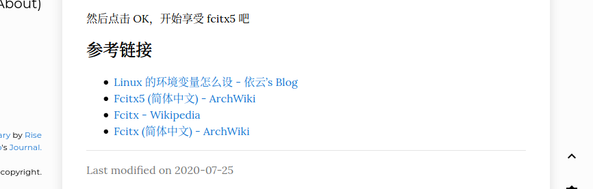
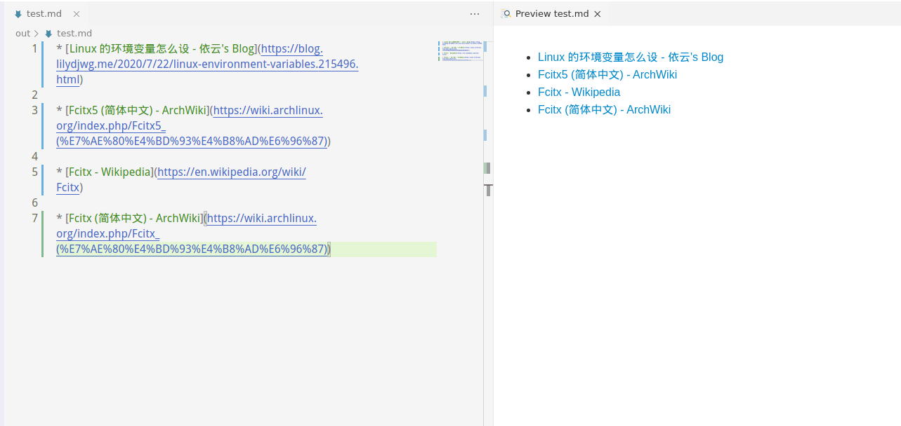

# TitleGetter
这是一个练习库

用来获取链接标题的小爬虫...
（你觉得可以用来干嘛呢？）

[English](README_EN.md)


## Bugs

部分链接（比较少见）爬取下来可能会出现乱码，这是编码问题导致的......

非批量模式下已经修复，在 `config.toml` 文件里面将 `EncodingFix` 设置为 `true` 即可。

批量模式目前正在想办法..

### 以下链接会出现乱码
```
Title: Carty - 生成超大文字绘 文字图片。特殊字符，符号尽在 超酷表情 Mega Emoji
URL: https://www.megaemoji.com/cn/generators/carty/

Title: Deepin 2014 Alpha –准备进入全新的深度世界 · LinuxTOY
URL: https://linuxtoy.org/archives/linux-deepin-2014-alpha-into-new-deepin-world.html

```

## 依赖

* Python
* 库
    * requests
    * bs4
    * toml
    * lxml

```
$ pip install requests bs4 toml lxml
```
不太清楚版本需求... 应该都能用吧...

## 使用
### 安装？
直接 `git clone`
```
$ git clone https://github.com/WeepingDogel/TitleGetter.git
```
### 示例

比如，当我们要写这样的东西时，我们在 `list.txt` 里面写入这些链接
```
https://blog.lilydjwg.me/2020/7/22/linux-environment-variables.215496.html
https://wiki.archlinux.org/index.php/Fcitx5_(%E7%AE%80%E4%BD%93%E4%B8%AD%E6%96%87)
https://en.wikipedia.org/wiki/Fcitx
https://wiki.archlinux.org/index.php/Fcitx_(%E7%AE%80%E4%BD%93%E4%B8%AD%E6%96%87)
```
然后修改配置文件 `config.toml`
```toml
# 以 MarkDown 格式输出
# Export as MarkDown format.
AsMarkDown = true

# 批量模式
# Barch Mode, to get a few..
# And write a file to storage the result
BatchMode = true
```
`AsMarkDown` 和 `BatchMode` 都改为 `true`
接下来，运行 `titlegetter.py` 这个文件
```
$ python titlegetter.py
```
然后输入一个文件名，随意，不需要带后缀

稍等片刻，就能在 `out/` 这个目录下获得这样的文件:
```markdown
[Linux 的环境变量怎么设 - 依云's Blog](https://blog.lilydjwg.me/2020/7/22/linux-environment-variables.215496.html)

[Fcitx5 (简体中文) - ArchWiki](https://wiki.archlinux.org/index.php/Fcitx5_(%E7%AE%80%E4%BD%93%E4%B8%AD%E6%96%87))

[Fcitx - Wikipedia](https://en.wikipedia.org/wiki/Fcitx)

[Fcitx (简体中文) - ArchWiki](https://wiki.archlinux.org/index.php/Fcitx_(%E7%AE%80%E4%BD%93%E4%B8%AD%E6%96%87))
```
如图

接下来复制粘贴到你要写的博客文件里就可以啦～

## 更新日志

* v 1.0.1

    更新了批量模式，采用了 toml 配置文件。
